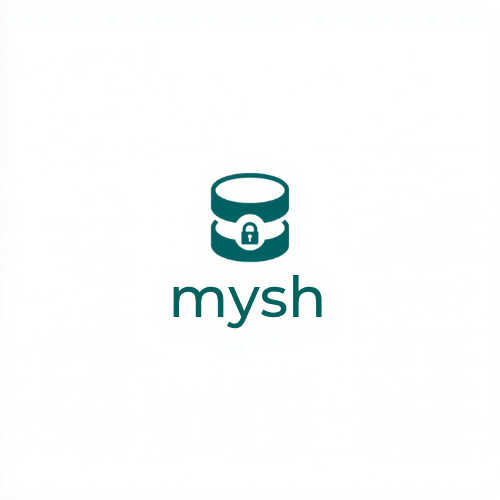

<p align="center">
  
</p>

<h1 align="center">mysh</h1>

[](https://github.com/atani/mysh/actions/workflows/ci.yml)
[](https://codecov.io/gh/atani/mysh)
[](https://goreportcard.com/report/github.com/atani/mysh)
[](https://pkg.go.dev/github.com/atani/mysh)
[](https://opensource.org/licenses/MIT)

**Stop leaking production data to AI coding agents.**

mysh is a safer MySQL CLI for the AI coding era: it manages connection profiles, SSH tunnels, and query output so Claude Code, Cursor, shell scripts, and MCP clients can work with production-like databases without accidentally seeing raw sensitive data.

*Pronounced "my-sh" (/maɪʃ/), like "my shell".*


> **New to mysh?** See the [Getting Started guide for non-engineers](docs/getting-started.md) — set up in 5 minutes and start querying with Claude Code.
>
> If you believe AI agents should never receive raw production PII, consider starring the repo to help more teams find it.

## Why mysh?

Traditional MySQL clients are great for humans, but risky in AI-assisted workflows: query results can be copied into prompts, captured by scripts, or returned to agents without a final privacy check.

mysh is built for that gap:

- **AI-safe by default**: automatically masks configured sensitive fields in production and non-TTY contexts
- **One command for secure access**: handles MySQL connection profiles and SSH tunnels together
- **Team-friendly onboarding**: export shared connection configs without passwords, then let each teammate enter their own credentials
- **Works with existing tools**: import connections from DBeaver, Sequel Ace, and MySQL Workbench
- **Cross-platform**: install via Homebrew, winget/MSI, standalone binaries, or `go install`

## AI-safe output masking

When mysh detects production data or output captured by an AI agent/script, it masks sensitive values before they leave the CLI.

```bash
mysh run production -e "SELECT id, name, email, phone FROM users LIMIT 2" --format markdown
```

Example masked output:

| id | name | email | phone |
|----|------|-------|-------|
| 1 | A*** | a***@example.com | 0*** |
| 2 | B*** | b***@example.com | 0*** |

Production `--raw` output requires an interactive TTY confirmation, so AI tools and non-interactive scripts cannot silently bypass masking.

That means the default failure mode changes from "an agent captured raw rows" to "sensitive-looking values were masked before leaving the CLI."

See [Using mysh safely with AI coding agents](docs/ai-agent-safety.md) for recommended configuration and team workflow guidance.

## MCP server (native AI-agent integration)

mysh ships a built-in [Model Context Protocol](https://modelcontextprotocol.io) server, so AI coding agents can query your databases as a first-class tool instead of shelling out to the CLI. The same masking rules apply, and **raw output cannot be requested over MCP** — sensitive values are masked before they ever reach the agent.

**1. Configure a connection first.** The MCP server reads the same connections you set up for the CLI (`~/.config/mysh/connections.yaml`); it does not define its own. Set one up with `mysh add`, `mysh import`, or the Redash flags, and verify with `mysh list` / `mysh ping`. There are no `add`/`edit`/`remove` tools over MCP by design.

**2. Register the server with Claude Code:**

```bash
claude mcp add mysh -- mysh mcp
```

Or add it to any MCP client config (e.g. Cursor, `claude_desktop_config.json`):

```json
{
  "mcpServers": {
    "mysh": { "command": "mysh", "args": ["mcp"] }
  }
}
```

**3. Make the master password available.** Connections with encrypted credentials need the master password to decrypt them. Since the MCP transport is non-interactive, the server never prompts: run any `mysh` command interactively once (it is saved to the macOS Keychain / Windows Credential Manager), or set `MYSH_MASTER_PASSWORD` in the server's environment. If it is missing, `mysh_query`/`mysh_ping` return a clear error instead of hanging.

Exposed tools: `mysh_list_connections`, `mysh_query`, `mysh_tables`, `mysh_ping`. No hosting, API key, or extra service is required — the server runs locally over stdio. See the [MCP Server Guide](docs/mcp-guide.md) for details.

## Common use cases

- Query production-like MySQL databases from Claude Code or Cursor without returning raw PII to the agent
- Give non-engineer teammates a safer, preconfigured way to query through Redash or shared connection profiles
- Replace ad-hoc SSH tunnel commands with reusable database profiles
- Export query results as Markdown for AI/code-review contexts or CSV/JSON/PDF for reporting
- Import existing database client profiles instead of rebuilding them by hand

## Feature comparison

| Feature | `mysql` CLI | `mycli` | DBeaver | mysh |
|---|:---:|:---:|:---:|:---:|
| CLI-first workflow | ✅ | ✅ | ❌ | ✅ |
| Connection profile management | ❌ | ⚠️ | ✅ | ✅ |
| SSH tunnel management | ❌ | ❌ | ✅ | ✅ |
| Automatic masking for AI/non-TTY output | ❌ | ❌ | ❌ | ✅ |
| Production `--raw` safety confirmation | ❌ | ❌ | ❌ | ✅ |
| Import from GUI database clients | ❌ | ❌ | — | ✅ |
| Team-safe config export without passwords | ❌ | ❌ | ⚠️ | ✅ |
| Markdown/CSV/JSON/PDF export | ❌ | ❌ | ✅ | ✅ |
| MySQL 4.x old_password support | ⚠️ | ⚠️ | ⚠️ | ✅ |

## Features

- Interactive connection setup with encrypted password storage (AES-256-GCM + Argon2id)
- SSH tunnel management (ad-hoc and background persistent tunnels)
- Automatic output masking for AI/non-TTY execution (protects personal data in production)
- Built-in MCP server (`mysh mcp`) so AI agents can query databases natively, with masking enforced
- Multiple connections across different terminals without conflicts
- mycli preferred, falls back to standard mysql client
- Native Go driver with MySQL 4.x old_password authentication support
- Output format conversion (plain, markdown, CSV, JSON, PDF) with file export
- Import connections from DBeaver, Sequel Ace, and MySQL Workbench
- MySQL 4.x+ compatible (native driver) / MySQL 5.1+ compatible (CLI driver)

## Install

### macOS / Linux

```bash
brew tap atani/tap
brew install mysh
```

### Windows

#### MSI installer

Download `mysh-windows-x64.msi` (or `-arm64`) from the
[latest release](https://github.com/atani/mysh/releases/latest) and run it.
The installer places `mysh.exe` under `C:\Program Files\mysh` by default (or a
folder you choose) and adds it to the system PATH.

#### winget

```powershell
winget install atani.mysh
```

winget downloads and runs the MSI for you. If you need an offline installer or
want to choose the install location manually, use the MSI installer above.

#### Standalone binary

Download `mysh-windows-amd64.exe` from the
[latest release](https://github.com/atani/mysh/releases/latest), rename it to
`mysh.exe`, and place it in a directory on your PATH.

> [!NOTE]
> The MSI and winget package are not code-signed yet, so Windows SmartScreen may
> show an "unknown publisher" prompt, and some endpoint-protection or ASR
> (Attack Surface Reduction) policies may block the installer. In managed
> environments an administrator may need to allow `mysh.exe`. A consistent
> install path (`C:\Program Files\mysh`) makes a path-based ASR exclusion
> straightforward, which is why the MSI keeps this path uniform across machines.

### Go

```bash
go install github.com/atani/mysh@latest
```

## Quick Start

```bash
# Add a connection interactively
mysh add

# Test connection (name optional if only one connection)
mysh ping

# Connect
mysh connect
```

## Usage

```
mysh <command> [arguments]
```

### Connection Management

```bash
# Add a new connection (interactive)
mysh add

# List all connections
mysh list

# Edit an existing connection
mysh edit production

# Remove a connection
mysh remove production
```

Connection name can be omitted when only one connection exists.

### Import from Other Tools

Import connections from other database tools:

- [Migrating from DBeaver](docs/import-guide.md#migrating-from-dbeaver)
- [Migrating from Sequel Ace](docs/import-guide.md#migrating-from-sequel-ace)
- [Migrating from MySQL Workbench](docs/import-guide.md#migrating-from-mysql-workbench)

```bash
mysh import --from dbeaver        # Import from DBeaver
mysh import --from sequel-ace     # Import from Sequel Ace
mysh import --from workbench      # Import from MySQL Workbench
mysh import --from dbeaver --all  # Import all without selection prompt
```

### Share Connections

Export connections for team members (passwords are always excluded):

```bash
# Export all connections
mysh export > connections.yaml

# Export a specific connection
mysh export production > prod.yaml
```

Recipients import the shared file and enter their own password:

```bash
mysh import --from yaml --file prod.yaml
```

For direct DB connections where each team member has their own DB username, use `--ask-user` or pass one username with `--db-user`. If several DB connections share the same password, `--reuse-password` asks for it once:

```bash
mysh import --from yaml --file team-db.yaml --all --ask-user
mysh import --from yaml --file team-db.yaml --all --db-user alice --reuse-password
```

Exported files include environment, SSH, and mask settings, so non-engineer users get a fully configured connection — they only need to enter their own database credentials or Redash API key.

### Redash Integration

Query production databases through Redash instead of direct DB connections. No database credentials or SSH tunnels needed — just a Redash API key.

```bash
# Add a Redash connection
mysh add --name prod --redash-url https://redash.example.com --redash-key YOUR_API_KEY --redash-datasource 1

# Query through Redash (masking is applied automatically)
mysh run prod -e "SELECT * FROM users LIMIT 10"

# Test connectivity
mysh ping prod
```

This is ideal for non-engineer users (CS, marketing, PM) who need safe access to production data via AI assistants like Claude Code. The query flows through Redash, and mysh applies masking rules to the results before returning them.

### Connecting & Querying

```bash
# Test connection
mysh ping production

# Open an interactive MySQL session
mysh connect production

# Execute a SQL file
mysh run production query.sql

# Execute inline SQL
mysh run production -e "SELECT COUNT(*) FROM users"

# Show tables
mysh tables production
```

### SSH Tunnels

By default, `connect` and `run` open an ad-hoc SSH tunnel that closes when the command finishes.

For repeated access, start a persistent background tunnel:

```bash
# Start a background tunnel
mysh tunnel production

# List active tunnels
mysh tunnel

# connect/run will automatically reuse the background tunnel
mysh run production -e "SHOW PROCESSLIST"

# Stop a tunnel
mysh tunnel stop production
```

Multiple tunnels can run simultaneously for different connections.

### Output Masking

mysh can automatically mask sensitive columns (email, phone, etc.) in query output. This is designed to prevent personal data from leaking into AI tool contexts.

#### How it works

Masking is controlled by two factors:

1. **Connection environment** (`env` in config)
2. **TTY detection** (is output going to a terminal or being captured?)

| env | Terminal (human) | Piped/captured (AI) |
|-----|-----------------|---------------------|
| production | **Auto-masked** | **Auto-masked** |
| staging | Raw | **Auto-masked** |
| development | Raw | Raw |

#### Configuration

```yaml
connections:
  - name: production
    env: production
    mask:
      columns: ["email", "phone", "password_hash"]
      patterns: ["*address*", "*secret*"]
    ssh: ...
    db: ...
```

#### Manual override

```bash
# Force masking (even in terminal)
mysh run production --mask -e "SELECT * FROM users LIMIT 5"

# Force raw output (requires interactive confirmation for production)
mysh run production --raw -e "SELECT * FROM users LIMIT 5"
```

For production connections, `--raw` requires interactive confirmation at the terminal. Non-TTY processes (AI tools, scripts) cannot bypass masking.

#### Masking examples

| Type | Original | Masked |
|------|----------|--------|
| Email | alice@example.com | a\*\*\*@example.com |
| Phone | 090-1234-5678 | 0\*\*\* |
| Name | Alice | A\*\*\* |
| Short value | ab | \*\*\* |
| NULL | NULL | NULL |

### Record Slicing

Extract specific records from a database as INSERT statements. Useful for creating reproducible test data or migrating individual records.

```bash
# Extract records matching a condition
mysh slice production products --where "category='electronics'"

# Save to file
mysh slice production products --where "id IN (7,8)" -o subset.sql

# Disable masking (requires interactive confirmation)
mysh slice production customers --where "id=3" --raw
```

Output example:

```sql
-- mysh slice: products WHERE category='electronics'
-- Generated at: 2026-03-15T12:00:00+09:00

INSERT INTO `products` (`id`, `name`, `price`) VALUES (7, 'Widget Pro', 2980);
INSERT INTO `products` (`id`, `name`, `price`) VALUES (8, 'Gadget Mini', NULL);
```

Masking rules from the connection config are always applied by default, regardless of environment. Use `--raw` to disable (requires interactive confirmation).

### Output Formats

Export query results as markdown, CSV, JSON, or PDF.

```bash
# Markdown table
mysh run production -e "SELECT * FROM users LIMIT 5" --format markdown

# CSV file
mysh run production -e "SELECT * FROM users" --format csv -o users.csv

# JSON output
mysh run production -e "SELECT * FROM users LIMIT 5" --format json

# JSON file
mysh run production -e "SELECT * FROM users" --format json -o users.json

# PDF report
mysh run production -e "SELECT * FROM users" --format pdf -o report.pdf

# tables command also supports format/output
mysh tables production --format csv -o tables.csv
```

Supported formats: `plain` (default), `markdown` (`md`), `csv`, `json`, `pdf`

### Saved Queries

Save `.sql` files in `~/.config/mysh/queries/` and list them with:

```bash
mysh queries
```

## Configuration

Connections are stored in `~/.config/mysh/connections.yaml`.

```yaml
connections:
  - name: production
    env: production
    ssh:
      host: bastion.example.com
      port: 22
      user: deploy
      key: ~/.ssh/id_ed25519
    mask:
      columns: [email, phone]
      patterns: ["*address*"]
    db:
      host: 127.0.0.1
      port: 3306
      user: app
      database: myapp_production
      password: <encrypted>

  - name: legacy-db
    env: production
    db:
      host: 10.0.0.5
      port: 3306
      user: app
      database: legacy_production
      password: <encrypted>
      driver: native  # MySQL 4.x old_password support

  - name: local
    env: development
    db:
      host: localhost
      port: 3306
      user: root
      database: myapp_dev
```

### Connection Driver

The `driver` field selects how mysh connects to MySQL.

| driver | Description | Supported versions |
|--------|-------------|-------------------|
| `cli` (default) | Delegates to mysql/mycli CLI | MySQL 5.1+ |
| `native` | Direct connection via Go's database/sql | MySQL 4.x+ |

The `native` driver uses `go-sql-driver/mysql` with `allowOldPasswords=true` to support MySQL 4.x old_password (mysql323) authentication. The `connect` command provides a simple REPL instead of mycli/mysql.

## Environment Variables

| Variable | Description |
|----------|-------------|
| `MYSH_MASTER_PASSWORD` | Master password for credential decryption. Useful for non-interactive contexts (AI assistants, scripts). |

The master password lookup order is: **OS credential store (macOS Keychain / Windows Credential Manager) → `MYSH_MASTER_PASSWORD` → interactive prompt**.

On macOS and Windows, the master password is saved to the OS credential store on first use, so you don't need to set `MYSH_MASTER_PASSWORD` for unattended runs (e.g. from AI assistants). On platforms without a supported store, use the environment variable or the interactive prompt.

## FAQ for AI-assisted database workflows

### Why not just tell the AI not to expose secrets?

Prompt instructions are useful, but they are not a data-loss prevention boundary. If raw query output is copied into an agent context, logs, CI output, or a bug report, the leak has already happened. mysh masks configured sensitive fields before the output leaves the CLI or MCP server.

### Why not use a generic SQL MCP server?

Generic SQL MCP servers make database access convenient, but many are optimized for query execution rather than privacy-by-default output handling. mysh exposes MySQL access through MCP while reusing the same connection profiles, SSH tunnels, and masking rules as the CLI. Raw output cannot be requested over MCP.

### Is mysh a compliance or DLP product?

No. mysh reduces accidental CLI-output leakage in AI-assisted workflows; it is not a replacement for access control, audit logging, database permissions, or a full compliance program. Treat it as a safer local workflow layer.

### Who is mysh for?

- Engineers using Claude Code, Cursor, or scripts with database-backed applications
- Teams that need shared database profiles without shared passwords
- Support or operations workflows that export query results as Markdown, CSV, JSON, or PDF
- Maintainers who want safer defaults before letting AI tools inspect production-like data

## Security

- Database passwords are encrypted with AES-256-GCM
- Key derivation uses Argon2id (memory-hard, resistant to GPU attacks)
- Master password is stored in the OS credential store — macOS Keychain or Windows Credential Manager (falls back to `MYSH_MASTER_PASSWORD` env var, then prompt)
- Config files are created with `0600` permissions
- Production query output is always masked when mask rules are configured
- `--raw` on production requires interactive TTY confirmation (AI tools cannot bypass)

## Caveats

- **old_password is cryptographically weak**: MySQL 4.x old_password (mysql323 hash) is a 16-byte XOR-based hash that does not meet modern security standards. Use the native driver only for legacy system connectivity.
- **Native driver `connect` limitations**: Unlike mycli/mysql CLI, the built-in REPL has no tab completion, syntax highlighting, or pager. For complex interactive work, prefer `run -e`.
- **go-sql-driver/mysql `allowOldPasswords`**: This depends on the driver's support, which may be removed in future driver updates.

## Documentation

- [Getting Started (non-engineers)](docs/getting-started.md) — set up mysh and start querying with Claude Code
- [Using mysh safely with AI coding agents](docs/ai-agent-safety.md) — recommended masking and workflow guidance for Claude Code, Cursor, scripts, and other agents
- [MCP Server Guide](docs/mcp-guide.md) — expose mysh to AI agents over the Model Context Protocol
- [Redash Integration Guide](docs/redash-guide.md) — query databases through Redash
- [Sharing Connections](docs/sharing-connections.md) — export/import configurations for team onboarding
- [Import Guide](docs/import-guide.md) — migrate from DBeaver, Sequel Ace, MySQL Workbench
- [Launch Kit](docs/launch-kit.md) — copy-ready English posts for Show HN, Reddit, X/Bluesky, and other communities
- [Global Launch Checklist](docs/global-launch-checklist.md) — repository metadata, launch order, and follow-up checklist

Japanese translations are available under [`docs/ja/`](docs/ja/)（日本語ドキュメントは [`docs/ja/`](docs/ja/) を参照）.

## Dependencies

- `golang.org/x/crypto` - Argon2id key derivation
- `golang.org/x/term` - Secure password input and TTY detection
- `gopkg.in/yaml.v3` - Configuration file parsing
- `github.com/go-sql-driver/mysql` - Native MySQL driver (old_password support)
- `github.com/go-pdf/fpdf` - PDF output
